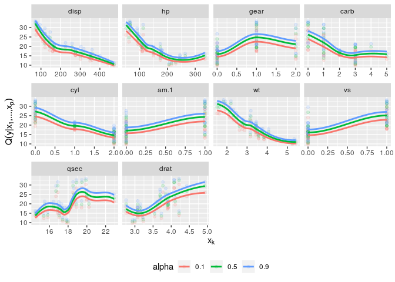

<!-- README.md is generated from README.Rmd. Please edit that file -->

# vinereg

<!--  -->

An R package for D-vine copula based mean and quantile regression.

## How to install

-   the stable release from CRAN:

        install.packages("vinereg")

-   the latest development version:

        # install.packages("remotes")
        remotes::install_github("tnagler/vinereg", build_vignettes = TRUE)

## Functionality

See the [package website](https://tnagler.github.io/vinereg/).

## Example

    set.seed(5)
    library(vinereg)
    data(mtcars)

    # declare factors and discrete variables
    for (var in c("cyl", "vs", "gear", "carb"))
        mtcars[[var]] <- as.ordered(mtcars[[var]])
    mtcars[["am"]] <- as.factor(mtcars[["am"]])

    # fit model
    (fit <- vinereg(mpg ~ ., family = "nonpar", data = mtcars))
    #> D-vine regression model: mpg | disp, qsec, hp, drat 
    #> nobs = 32, edf = 25.6, cll = -51.94, caic = 155.08, cbic = 192.61

    summary(fit)
    #>    var       edf         cll       caic       cbic      p_value
    #> 1  mpg  0.000000 -100.189867 200.379733 200.379733           NA
    #> 2 disp 13.187762   29.521786 -32.668047 -13.338271 9.065782e-08
    #> 3 qsec  2.272103    4.454079  -4.363952  -1.033648 1.559593e-02
    #> 4   hp  7.178554   10.836467  -7.315826   3.206038 3.267907e-03
    #> 5 drat  2.965553    3.441702  -0.952298   3.394419 7.382604e-02

    # show marginal effects for all selected variables
    plot_effects(fit)
    #> `geom_smooth()` using method = 'loess' and formula = 'y ~ x'

    # predict mean and median
    head(predict(fit, mtcars, alpha = c(NA, 0.5)), 4)
    #>       mean      0.5
    #> 1 22.58394 22.45433
    #> 2 22.53425 22.41825
    #> 3 25.10289 24.93384
    #> 4 20.70358 20.80241

## Vignettes

For more examples, have a look at the vignettes with

    vignette("abalone-example", package = "vinereg")
    vignette("bike-rental", package = "vinereg")

### References

Kraus and Czado (2017). D-vine copula based quantile regression.
*Computational Statistics & Data Analysis*, 110, 1-18.
[link](https://www.sciencedirect.com/science/article/pii/S0167947316303073),
[preprint](https://arxiv.org/abs/1510.04161)

Schallhorn, N., Kraus, D., Nagler, T., Czado, C. (2017). D-vine quantile
regression with discrete variables. Working paper,
[preprint](https://arxiv.org/abs/1705.08310).
