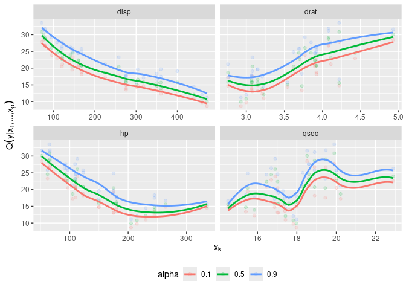

<!-- README.md is generated from README.Rmd. Please edit that file -->
vinereg
=======

[](https://travis-ci.org/tnagler/vinereg) [](https://ci.appveyor.com/project/tnagler/vinereg) [](https://codecov.io/github/tnagler/vinereg?branch=master) [](https://cran.r-project.org/package=vinereg)

An R package for D-vine copula based mean and quantile regression.

How to install
--------------

-   the stable release from CRAN:

``` r
install.packages("vinereg")
```

-   the latest development version:

``` r
# install.packages("devtools")
devtools::install_github("tnagler/vinereg", build_vignettes = TRUE)
```

Functionality
-------------

See the [package website](https://tnagler.github.io/vinereg).

Example
-------

``` r
library(vinereg)
data(mtcars)

# declare factors and discrete variables
for (var in c("cyl", "vs", "gear", "carb"))
    mtcars[[var]] <- as.ordered(mtcars[[var]])
mtcars[["am"]] <- as.factor(mtcars[["am"]])

# fit model
(fit <- vinereg(mpg ~ ., data = mtcars))
#> D-vine regression model: mpg | disp, cyl, wt, carb, gear, hp, qsec, vs, am.1, drat 
#> nobs = 32, edf = 91, cll = -53.89, caic = 289.78, cbic = 423.17

summary(fit)
#>     var     edf         cll         caic        cbic      p_value
#> 1   mpg 3.2e-11 -98.5927195 197.18543898 197.1854390           NA
#> 2  disp 2.0e+00  29.5342816 -55.06856318 -52.1370914 1.490817e-13
#> 3   cyl 3.0e+00   5.3128672  -4.62573447  -0.2285268 1.393178e-02
#> 4    wt 4.0e+00   4.0383425  -0.07668494   5.7862587 8.880917e-02
#> 5  carb 7.0e+00   1.5845952  10.83080969  21.0909610 8.689220e-01
#> 6  gear 1.0e+01   1.2307931  17.53841376  32.1957728 9.914238e-01
#> 7    hp 1.0e+01   1.5297458  16.94050837  31.5978674 9.799891e-01
#> 8  qsec 1.3e+01   0.4923380  25.01532409  44.0698908 9.999965e-01
#> 9    vs 1.2e+01   0.5492991  22.90140188  40.4902327 9.999761e-01
#> 10 am.1 1.5e+01   0.2353038  29.52939230  51.5154308 1.000000e+00
#> 11 drat 1.5e+01   0.1931010  29.61379802  51.5998366 1.000000e+00

# show marginal effects for all selected variables
plot_effects(fit)
#> `geom_smooth()` using method = 'loess' and formula 'y ~ x'
```



``` r

# predict mean and median
head(predict(fit, mtcars, alpha = c(NA, 0.5)), 4)
#>       mean      0.5
#> 1 19.12384 19.01768
#> 2 19.14141 19.04763
#> 3 28.28939 28.52435
#> 4 21.30317 20.99698
```

Vignettes
---------

For more examples, have a look at the vignettes with

``` r
vignette("abalone-example", package = "vinereg")
vignette("bike-rental", package = "vinereg")
```

### References

Kraus and Czado (2017). D-vine copula based quantile regression. *Computational Statistics & Data Analysis*, 110, 1-18. [link](https://www.sciencedirect.com/science/article/pii/S0167947316303073), [preprint](https://arxiv.org/abs/1510.04161)

Schallhorn, N., Kraus, D., Nagler, T., Czado, C. (2017). D-vine quantile regression with discrete variables. Working paper, [preprint](https://arxiv.org/abs/1705.08310).
