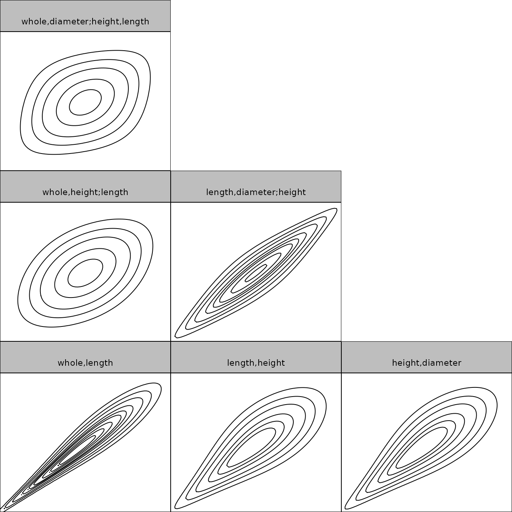
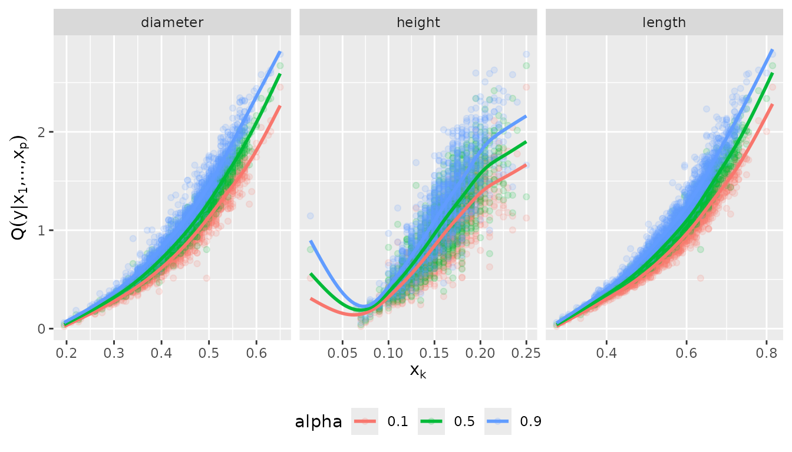
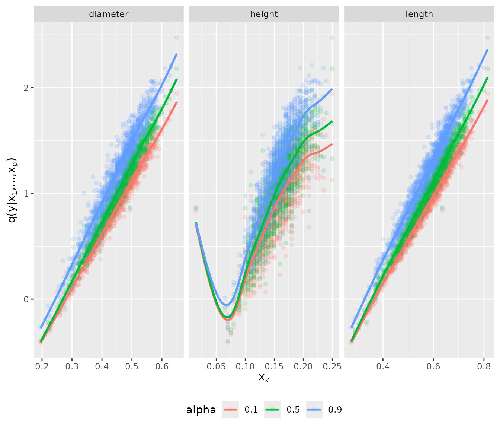
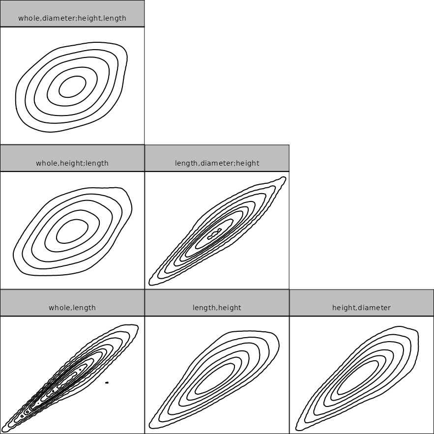
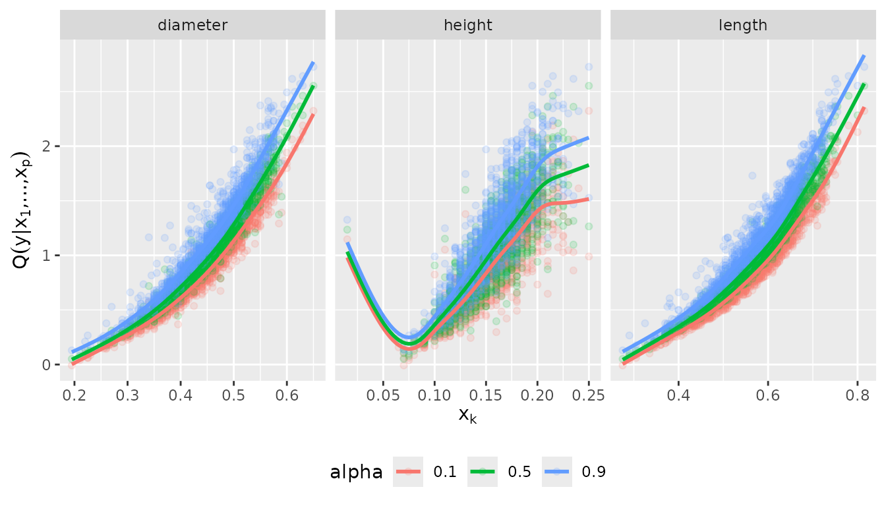
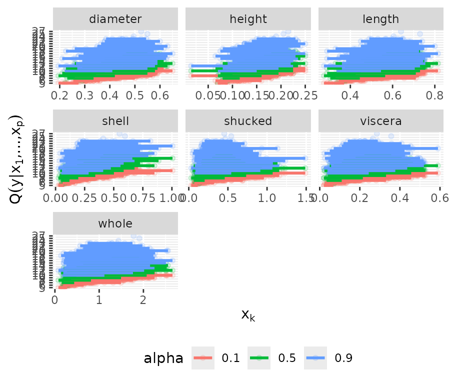

# Example usage of the vinereg package

This file contains the source code of an exemplary application of the
D-vine copula based quantile regression approach implemented in the
R-package *vinereg* and presented in Kraus and Czado (2017): *D-vine
copula based quantile regression*, Computational Statistics and Data
Analysis, 110, 1-18. Please, feel free to address questions to
<daniel.kraus@tum.de>.

## Load required packages

``` r

library(vinereg) 
library(ggplot2)
library(dplyr)
library(tidyr)
library(AppliedPredictiveModeling)
```

## Data analysis

``` r

set.seed(5)
```

We consider the data set `abalone` from the UCI Machine Learning
Repository (<https://archive.ics.uci.edu/ml/datasets/abalone>) and focus
on the female sub-population. In a first application we only consider
continuous variables and fit models to predict the quantiles of weight
(`whole`) given the predictors `length`, `diameter`, and `height`.

### Load and clean data

``` r

data(abalone, package = "AppliedPredictiveModeling")
colnames(abalone) <- c(
  "sex", "length", "diameter", "height", "whole", 
  "shucked", "viscera", "shell", "rings"
)
abalone_f <- abalone %>%
    dplyr::filter(sex == "F") %>%        # select female abalones
    dplyr::select(-sex) %>%         # remove id and sex variables
    dplyr::filter(height < max(height))  # remove height outlier
```

``` r

pairs(abalone_f, pch = ".")
```


## D-vine regression models

### Parametric D-vine quantile regression

We consider the female subset and fit a parametric regression D-vine for
the response weight given the covariates len, diameter and height
(ignoring the discreteness of some of the variables). The D-vine based
model is selected sequentially by maximizing the conditional
log-likelihood of the response given the covariates. Covariates are only
added if they increase the (possibly AIC- or BIC-corrected) conditional
log-likelihood.

We use the function
[`vinereg()`](https://tnagler.github.io/vinereg/reference/vinereg.md) to
fit a regression D-vine for predicting the response weight given the
covariates `length`, `diameter`, and `height`. The argument `family_set`
determines how the pair-copulas are estimated. We will only use
one-parameter families and the *t* copula here. The `selcrit` argument
specifies the penalty type for the conditional log-likelihood criterion
for variable selection.

``` r

fit_vine_par <- vinereg(
  whole ~ length + diameter + height, 
  data = abalone_f,  
  family_set = c("onepar", "t"),
  selcrit = "aic"
)
```

The result has a field `order` that shows the selected covariates and
their ranking order in the D-vine.

``` r

fit_vine_par$order
```

    ## [1] "length"   "height"   "diameter"

The field `vine` contains the fitted D-vine, where the first variable
corresponds to the response. The object is of class `"vinecop_dist"` so
we can use `rvineocpulib`’s functionality to summarize the model

``` r

summary(fit_vine_par$vine)
```

    ## # A data.frame: 6 x 11 
    ##  tree edge conditioned conditioning var_types family rotation  parameters df
    ##     1    1        1, 2                    c,c gumbel      180         5.2  1
    ##     1    2        2, 4                    c,c gumbel      180         2.4  1
    ##     1    3        4, 3                    c,c gumbel      180         2.4  1
    ##     2    1        1, 4            2       c,c      t        0 0.45, 21.87  2
    ##     2    2        2, 3            4       c,c      t        0  0.91, 4.68  2
    ##     3    1        1, 3         4, 2       c,c      t        0  0.31, 7.40  2
    ##   tau loglik
    ##  0.81   1629
    ##  0.58    672
    ##  0.59    709
    ##  0.30    147
    ##  0.73   1193
    ##  0.20     72
    ## 
    ## ---
    ## 1 <-> whole,   2 <-> length,   3 <-> diameter,   4 <-> height

We can also plot the contours of the fitted pair-copulas.

``` r

contour(fit_vine_par$vine)
```



### Estimation of corresponding conditional quantiles

In order to visualize the predicted influence of the covariates, we plot
the estimated quantiles arising from the D-vine model at levels 0.1, 0.5
and 0.9 against each of the covariates.

``` r

# quantile levels
alpha_vec <- c(0.1, 0.5, 0.9) 
```

We call the [`fitted()`](https://rdrr.io/r/stats/fitted.values.html)
function on `fit_vine_par` to extract the fitted values for multiple
quantile levels. This is equivalent to predicting the quantile at the
training data. The latter function is more useful for out-of-sample
predictions.

``` r

pred_vine_par <- fitted(fit_vine_par, alpha = alpha_vec)
# equivalent to:
# predict(fit_vine_par, newdata = abalone.f, alpha = alpha_vec)
head(pred_vine_par)
```

    ##         0.1       0.5       0.9
    ## 1 0.6717861 0.7667223 0.8716320
    ## 2 0.6968824 0.7903848 0.9014622
    ## 3 0.6794483 0.7843662 0.8914414
    ## 4 0.7754028 0.8800504 0.9976867
    ## 5 0.5950433 0.6996903 0.8273503
    ## 6 0.6755813 0.7729167 0.8860185

To examine the effect of the individual variables, we will plot the
predicted quantiles against each of the variables. To visualize the
relationship more clearly, we add a smoothed line for each quantile
level. For a displayed variable, this estimates the fitted conditional
quantile averaged over the conditional distribution of the other
variables.

``` r

plot_effects(fit_vine_par)
```

    ## `geom_smooth()` using method = 'gam' and formula = 'y ~ s(x, bs = "cs")'



The fitted quantile curves suggest a non-linear effect of all three
variables.

### Comparison to the benchmark model: linear quantile regression

This can be compared to linear quantile regression:

``` r

pred_lqr <- pred_vine_par
for (a in seq_along(alpha_vec)) {
    my.rq <- quantreg::rq(
        whole ~ length + diameter + height, 
        tau = alpha_vec[a], 
        data = abalone_f
    )
    pred_lqr[, a] <- quantreg::predict.rq(my.rq)
}

plot_marginal_effects <- function(covs, preds) {
    cbind(covs, preds) %>%
        tidyr::gather(alpha, prediction, -seq_len(NCOL(covs))) %>%
        dplyr::mutate(prediction = as.numeric(prediction)) %>%
        tidyr::gather(variable, value, -(alpha:prediction)) %>%
        ggplot(aes(value, prediction, color = alpha)) +
        geom_point(alpha = 0.15) + 
        geom_smooth(method = "gam", formula = y ~ s(x, bs = "cs"), se = FALSE) + 
        facet_wrap(~ variable, scale = "free_x") +
        ylab(quote(q(y* "|" * x[1] * ",...," * x[p]))) +
        xlab(quote(x[k])) +
        theme(legend.position = "bottom")
}
plot_marginal_effects(abalone_f[, 1:3], pred_lqr)
```



### Nonparametric D-vine quantile regression

We also want to check whether these results change, when we estimate the
pair-copulas nonparametrically.

``` r

fit_vine_np <- vinereg(
  whole ~ length + diameter + height,
  data = abalone_f,
  family_set = "nonpar",
  selcrit = "aic"
)
fit_vine_np
```

    ## D-vine regression model: whole | length, height, diameter
    ## nobs = 1306, edf = 95.39, cll = 1205.52, caic = -2220.26, cbic = -1726.63

``` r

contour(fit_vine_np$vine)
```



Now only the length and height variables are selected as predictors.
Let’s have a look at the marginal effects.

``` r

plot_effects(fit_vine_np, vars = c("diameter", "height", "length"))
```

    ## `geom_smooth()` using method = 'gam' and formula = 'y ~ s(x, bs = "cs")'



The effects look similar to the parametric ones, but slightly more
wiggly. Although diameter was not selected as a covariate, its marginal
curve can vary because diameter is associated with selected predictors.
It does not provide additional information once height and length are
accounted for.

### Discrete D-vine quantile regression

To deal with discrete variables, we use the methodology of Schallhorn et
al. (2017).

We let
[`vinereg()`](https://tnagler.github.io/vinereg/reference/vinereg.md)
know that a variable is discrete by declaring it `ordered`.

``` r

abalone_f$rings <- as.ordered(abalone_f$rings)
fit_disc <- vinereg(rings ~ ., data = abalone_f, selcrit = "aic")
fit_disc
```

    ## D-vine regression model: rings | shell, shucked, whole, viscera, height, diameter, length
    ## nobs = 1306, edf = 23.33, cll = -2737.92, caic = 5522.5, cbic = 5643.25

``` r

plot_effects(fit_disc)
```

    ## `geom_smooth()` using method = 'loess' and formula = 'y ~ x'



## References

Kraus and Czado (2017), **D-vine copula based quantile regression**,
*Computational Statistics and Data Analysis, 110, 1-18*

Nagler (2017), **A generic approach to nonparametric function estimation
with mixed data**, *Statistics & Probability Letters, 137:326–330*

Schallhorn, Kraus, Nagler and Czado (2017), **D-vine quantile regression
with discrete variables**, *arXiv preprint*
