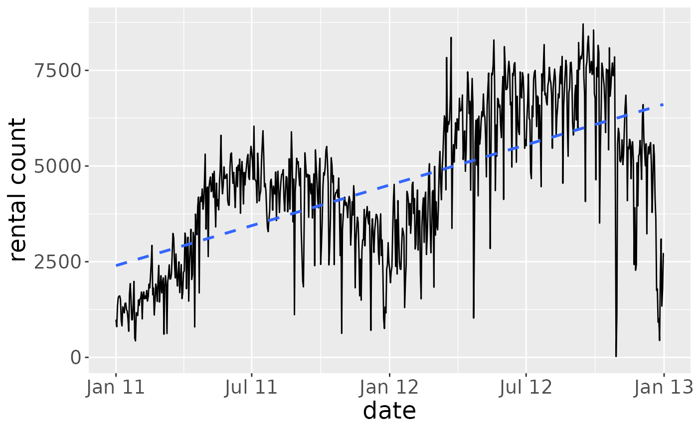
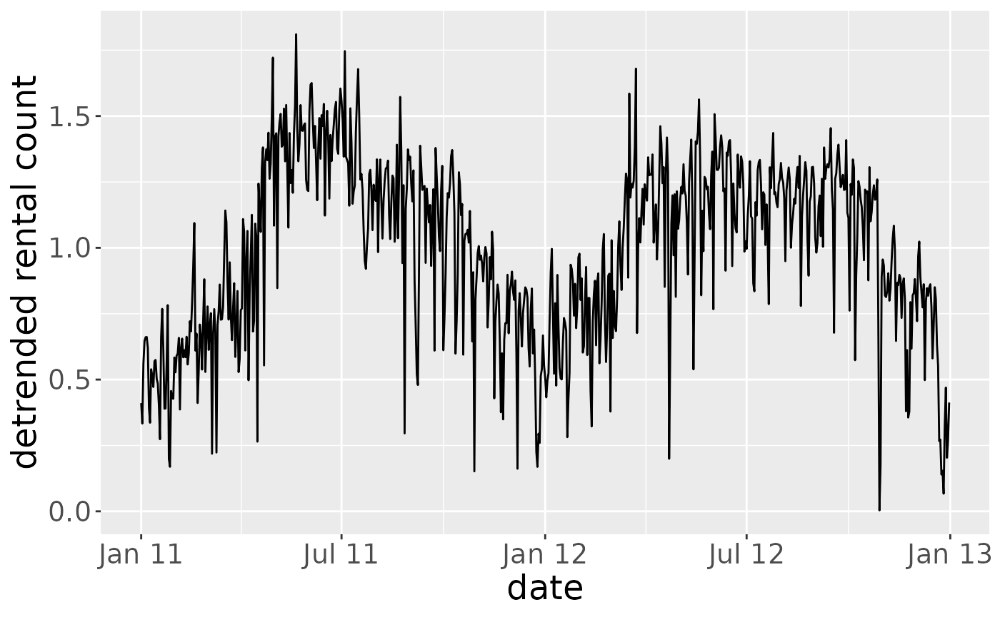
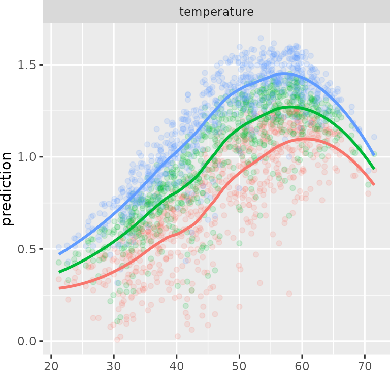
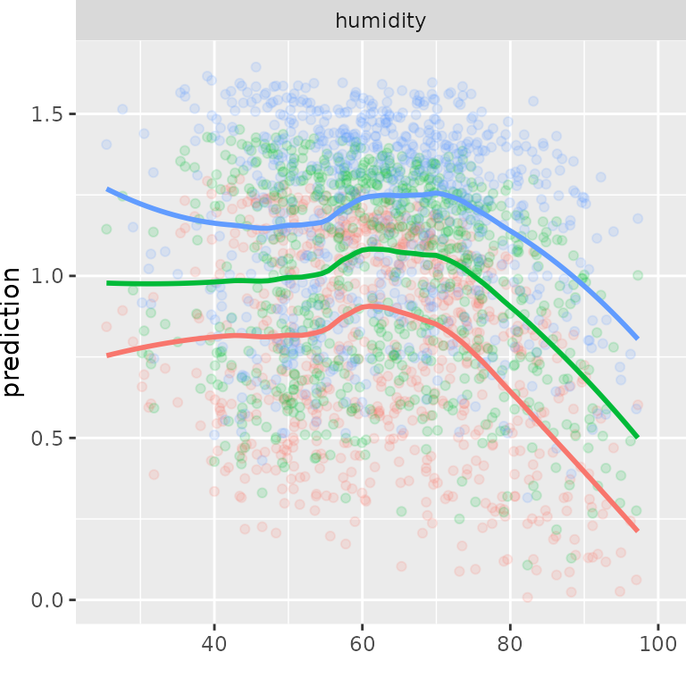
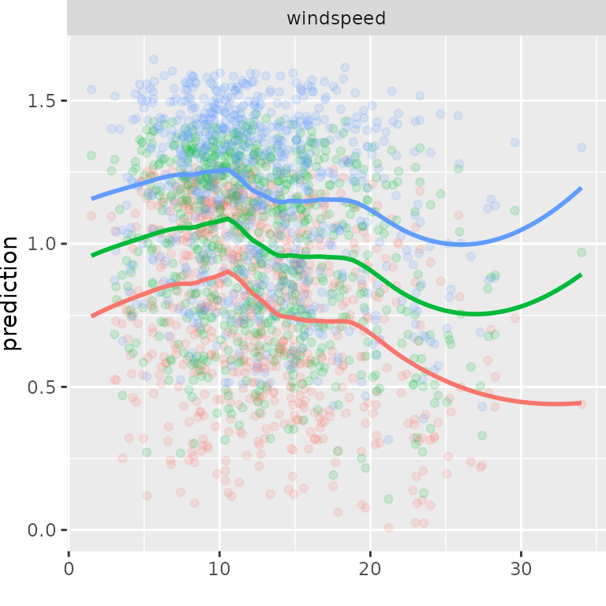
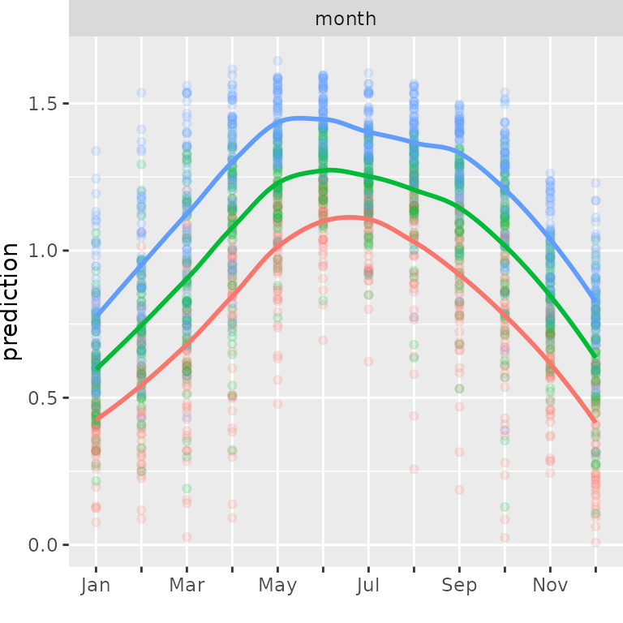
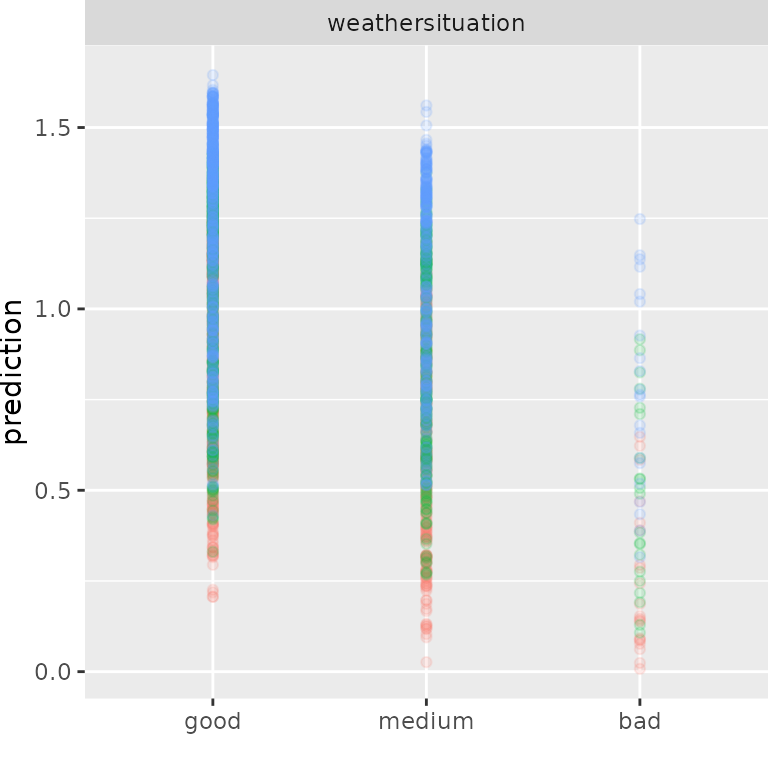
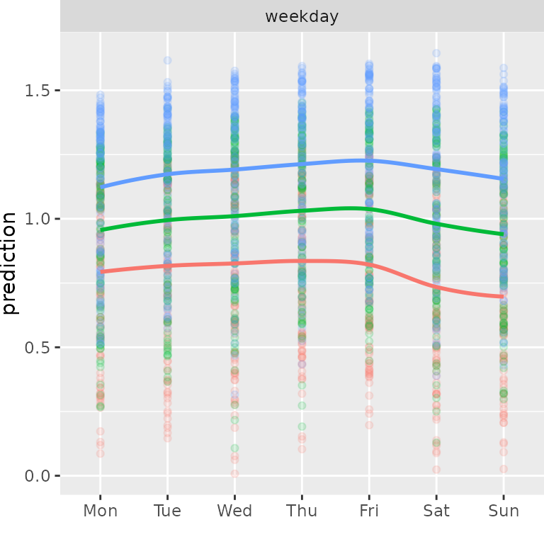
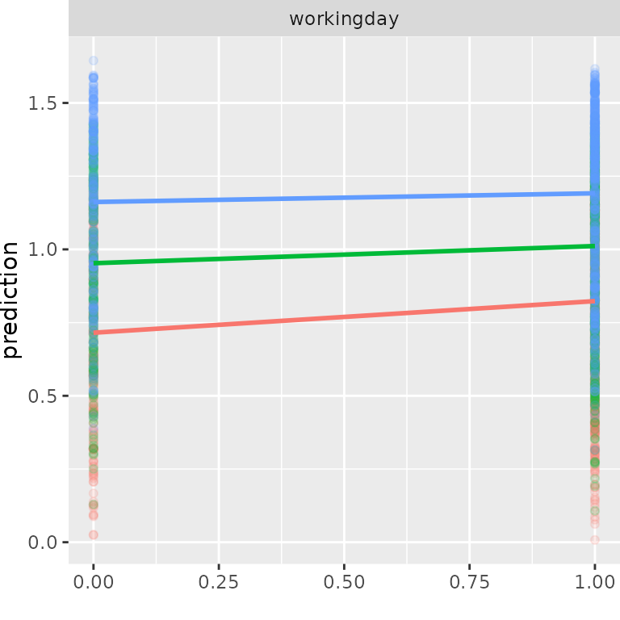
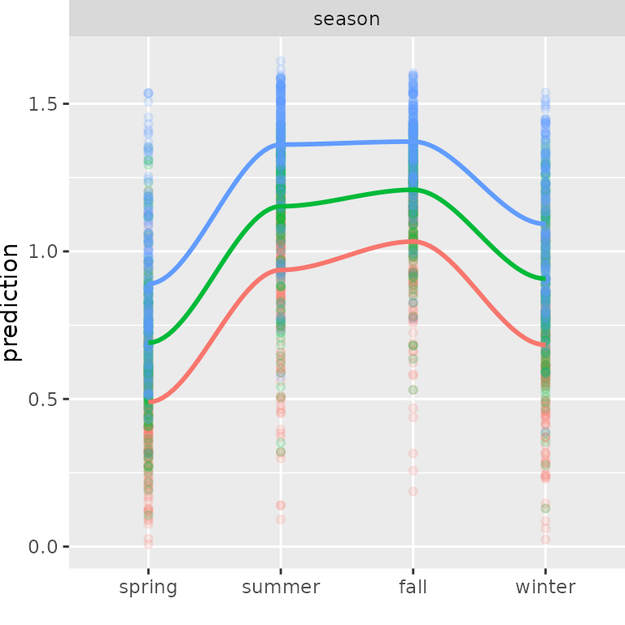

# D-vine quantile regression with discrete variables: analysis of bike rental data

#### Required packages

``` r

library(vinereg)
library(ggplot2)
library(dplyr)
library(purrr)
library(scales)
library(quantreg)
```

#### Plot function for marginal effects

``` r

plot_marginal_effects <- function(covs, preds) {
    cbind(covs, preds) %>%
        tidyr::gather(alpha, prediction, -seq_len(NCOL(covs))) %>%
        dplyr::mutate(prediction = as.numeric(prediction)) %>%
        tidyr::gather(variable, value, -(alpha:prediction)) %>%
        dplyr::mutate(value = as.numeric(value)) %>%
        ggplot(aes(value, prediction, color = alpha)) +
        geom_point(alpha = 0.15) + 
        geom_smooth(span = 0.5, se = FALSE) + 
        facet_wrap(~ variable, scale = "free_x") +
        theme(legend.position = "none") +
        theme(plot.margin = unit(c(0, 0, 0, 0), "mm")) +
        xlab("")
}
```

## Data preparation

#### Load data

``` r

bikedata <- read.csv("day.csv")
bikedata[, 2] <- as.Date(bikedata[, 2])
head(bikedata)
```

    ##   instant     dteday season yr mnth holiday weekday workingday weathersit
    ## 1       1 2011-01-01      1  0    1       0       6          0          2
    ## 2       2 2011-01-02      1  0    1       0       0          0          2
    ## 3       3 2011-01-03      1  0    1       0       1          1          1
    ## 4       4 2011-01-04      1  0    1       0       2          1          1
    ## 5       5 2011-01-05      1  0    1       0       3          1          1
    ## 6       6 2011-01-06      1  0    1       0       4          1          1
    ##       temp    atemp      hum windspeed casual registered  cnt
    ## 1 0.344167 0.363625 0.805833 0.1604460    331        654  985
    ## 2 0.363478 0.353739 0.696087 0.2485390    131        670  801
    ## 3 0.196364 0.189405 0.437273 0.2483090    120       1229 1349
    ## 4 0.200000 0.212122 0.590435 0.1602960    108       1454 1562
    ## 5 0.226957 0.229270 0.436957 0.1869000     82       1518 1600
    ## 6 0.204348 0.233209 0.518261 0.0895652     88       1518 1606

#### Rename variables

``` r

bikedata  <- bikedata %>%
    rename(
        temperature = atemp, 
        month = mnth,
        weathersituation = weathersit,
        humidity = hum,
        count = cnt
    )
```

#### Un-normalize variables

See variable description on UCI web page.

``` r

bikedata <- bikedata %>%
    mutate(
        temperature = 66 * temperature + 16,
        windspeed = 67 * windspeed,
        humidity = 100 * humidity
    )
```

#### Show trend

``` r

ggplot(bikedata, aes(dteday, count)) +
    geom_line() + 
    scale_x_date(labels = scales::date_format("%b %y")) + 
    xlab("date") + 
    ylab("rental count") + 
    stat_smooth(method = "lm", se = FALSE, linetype = "dashed") + 
    theme(plot.title = element_text(lineheight = 0.8, size = 20)) +
    theme(text = element_text(size = 18))
```



#### Remove trend

``` r

lm_trend <- lm(count ~ instant, data = bikedata)
trend <- predict(lm_trend)
bikedata <- mutate(bikedata, count = count / trend)
ggplot(bikedata, aes(dteday, count)) + 
    geom_line() + 
    scale_x_date(labels = scales::date_format("%b %y")) + 
    xlab("date") + 
    ylab("detrended rental count") + 
    theme(plot.title = element_text(lineheight = 0.8, size = 20)) + 
    theme(text = element_text(size = 18))
```



#### Drop useless variables

``` r

bikedata <- bikedata %>%
    select(-instant, -dteday, -yr) %>%  # time indices
    select(-casual, -registered) %>%    # casual + registered = count
    select(-holiday) %>%                # we use 'workingday' instead
    select(-temp)                       # we use 'temperature' (feeling temperature)
```

#### Declare discrete variables as `ordered`

``` r

disc_vars <- c("season", "month", "weekday", "workingday", "weathersituation")
bikedata <- bikedata %>%
    mutate(weekday = ifelse(weekday == 0, 7, weekday)) %>%  # sun at end of week
    purrr::modify_at(disc_vars, as.ordered)
```

## D-vine regression model

#### Fit model

``` r

fit <- vinereg(
  count ~ ., 
  data = bikedata, 
  family_set = c("onepar", "tll"),
  selcrit = "aic"
)
fit
```

    ## D-vine regression model: count | temperature, humidity, windspeed, month, season, weekday, weathersituation, workingday
    ## nobs = 731, edf = 82.66, cll = 446.61, caic = -727.9, cbic = -348.1

``` r

summary(fit)
```

    ##                var       edf         cll        caic        cbic       p_value
    ## 1            count  8.127625 -198.076002  412.407255  449.748927            NA
    ## 2      temperature 21.962102  415.807777 -787.691349 -686.788370 1.062642e-161
    ## 3         humidity 17.921054  118.868746 -201.895384 -119.558653  2.267548e-40
    ## 4        windspeed  1.000000   22.820159  -43.640319  -39.045905  1.420866e-11
    ## 5            month 16.094496   28.514118  -24.839244   49.105524  1.754541e-06
    ## 6           season  1.000000   13.507584  -25.015168  -20.420754  2.018652e-07
    ## 7          weekday 14.559185   27.319468  -25.520566   41.370347  1.501057e-06
    ## 8 weathersituation  1.000000   15.483648  -28.967297  -24.372883  2.624130e-08
    ## 9       workingday  1.000000    2.367034   -2.734067    1.860346  2.957088e-02

#### In-sample predictions

``` r

alpha_vec <- c(0.1, 0.5, 0.9)
pred <- fitted(fit, alpha_vec)
```

### Marginal effects

``` r

plot_marginal_effects(
    covs = select(bikedata, temperature), 
    preds = pred
)
```



``` r

plot_marginal_effects(covs = select(bikedata, humidity), preds = pred) +
    xlim(c(25, 100))
```



``` r

plot_marginal_effects(covs = select(bikedata, windspeed), preds = pred) 
```



``` r

month_labs <- c("Jan","", "Mar", "", "May", "", "Jul", "", "Sep", "", "Nov", "")
plot_marginal_effects(covs = select(bikedata, month), preds = pred) +
        scale_x_discrete(limits = 1:12, labels = month_labs)
```



``` r

plot_marginal_effects(covs = select(bikedata, weathersituation), 
                      preds = pred) +
    scale_x_discrete(limits = 1:3,labels = c("good", "medium", "bad"))
```



``` r

weekday_labs <- c("Mon", "Tue", "Wed", "Thu", "Fri", "Sat", "Sun")
plot_marginal_effects(covs = select(bikedata, weekday), preds = pred) +
    scale_x_discrete(limits = 1:7, labels = weekday_labs)
```



``` r

plot_marginal_effects(covs = select(bikedata, workingday), preds = pred) +
    scale_x_discrete(limits = 0:1, labels = c("no", "yes")) +
    geom_smooth(method = "lm", se = FALSE) +
    xlim(c(0, 1))
```



``` r

season_labs <- c("spring", "summer", "fall", "winter")
plot_marginal_effects(covs = select(bikedata, season), preds = pred) +
    scale_x_discrete(limits = 1:4, labels = season_labs)
```


